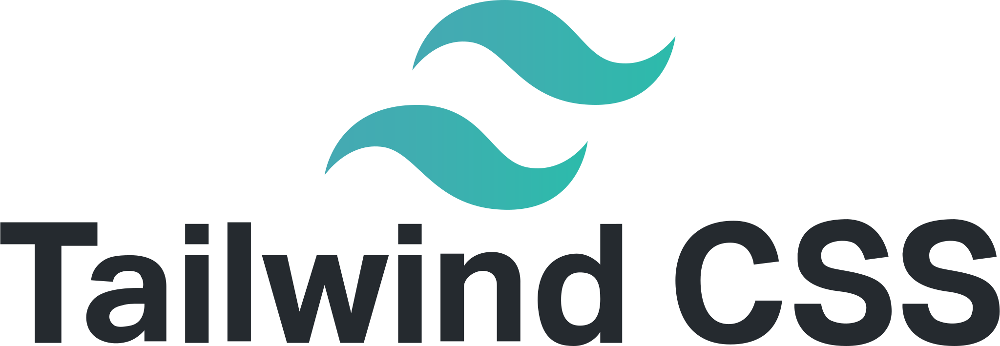

# 📜 Assignment 1 - Portofolio📜

Welcome to the repository for my personal portfolio website. This project showcases my skills and projects as a Fullstack Developer, built using **HTML**, **JavaScript**, and **Tailwind CSS**.

## 🌐 Live Preview


## 📋 Features

- **Responsive Design** 📱💻
  This website is optimized for various screen sizes, from mobile to desktop.
- **Smooth Navigation** 🧭
  Interactive and user-friendly navigation menu, both for desktop and mobile.

- **Attractive Animations** 🎨
  Key elements of the website are animated to enhance the user experience.

- **Portfolio Section** 💼
  Showcases various projects I have worked on, with detailed descriptions.

- **Easy Contact** 📞
  Users can easily contact me via WhatsApp or download my CV.

## 📂 Folder Structure

```bash
├── assets/
│   ├── icon-*.svg     # Icons used on the website
│   ├── profile-emoji.png  # Profile image in emoji style
│   └── *.png          # Project images
├── index.html         # Main HTML file
├── styles.css         # Tailwind CSS file
└── README.md          # This file
```

## 🚀 Technologies Used

-  HTML5 📝
-  JavaScript (Vanilla JS) 🚀
-  Tailwind CSS 🎨

## 🧑🏻‍💻 Author

- [@Muhammad Rifqi Setiawan](https://github.com/rifqi142)

## ⚙️ Installation

### 1. Clone the repository:

```bash
git clone https://github.com/rifqi142/portfolio-website.git
```

### 2. Open the index.html file in a browser. (I recommend running it using Live Server in VsCode extension)

### 3. Enjoy my portfolio! 🎉

## 🔗 Live Preview

Check out my portfolio website at: https://rifqi142.github.io/Assignment1_MuhRifqis/
